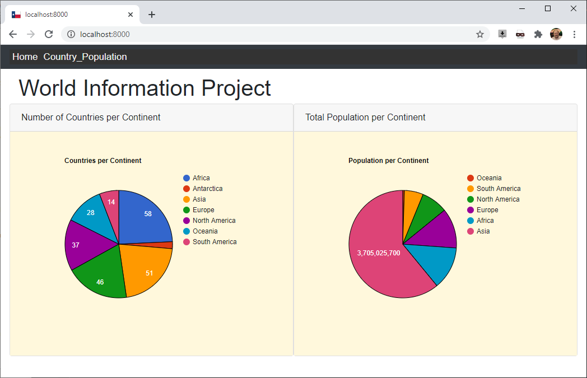
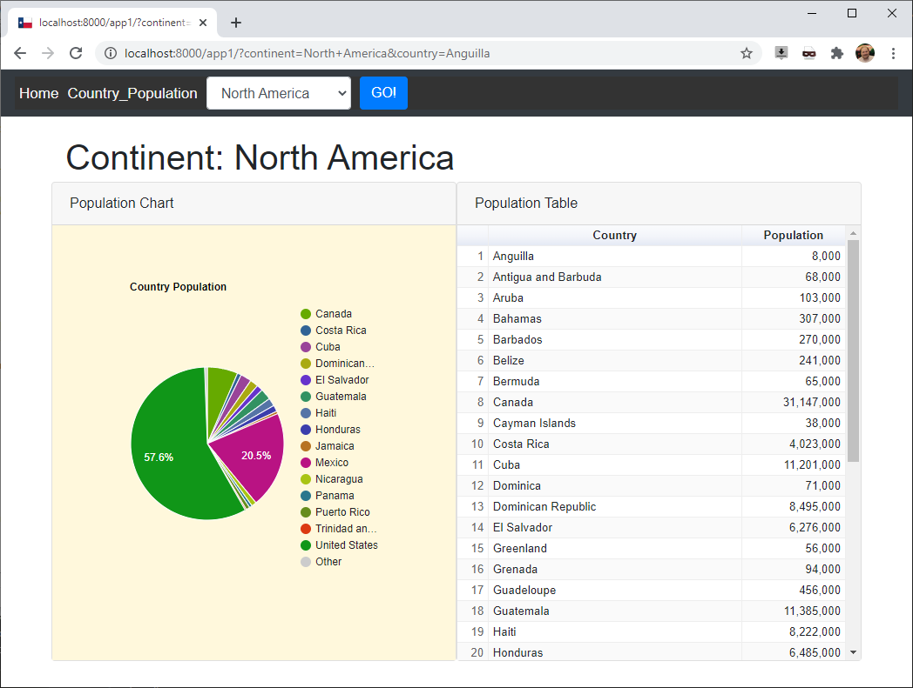
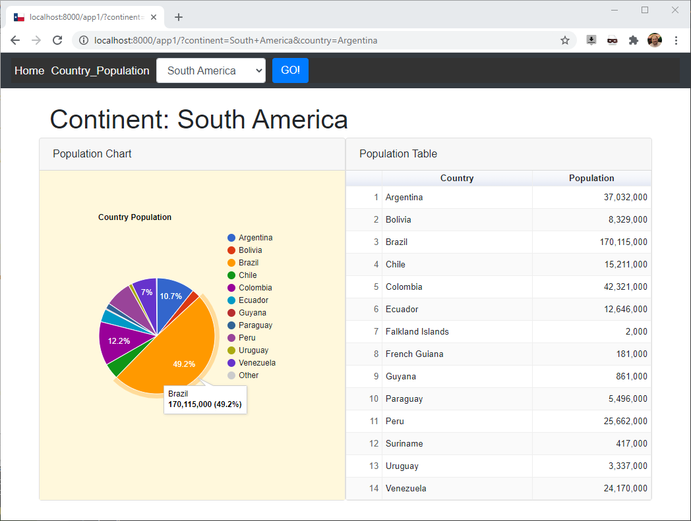

# World Information Project

<!-- TABLE OF CONTENTS -->

  
Table of Contents

  <ol>
    <li><a href="#about-the-project">About The Project</a></li>
    <li><a href="#tech-stack">Tech Stack</a></li>
    <li><a href="#the-database">The Database</a></li>
  </ol>

<!-- ABOUT THE PROJECT -->
## About The Project
This project is an example Django project that displays
information about the world.
 
The information is stored in a remote MySQL database on a RaspberryPI. 
The data retrived from the database is displayed as a graph using Google Charts. 

<!-- TECH STACK -->
## Tech Stack
The major frameworks used to develop this project
* [Django](https://www.djangoproject.com/), Version:2.2.17
* [Python](https://www.python.org/), Version: 3.6.5
* [MySQL](https://www.mysql.com/), Version: 10.1.38-MariaDB

<!-- THE DATABASE -->
## The Database
The database is installed on a RaspberryPI which is configured as the database server. 
The schema can be downloaded from the MySQL website [here.](https://dev.mysql.com/doc/index-other.html) 
The database installation instructions are [here.](https://dev.mysql.com/doc/world-setup/en/world-setup-installation.html)

